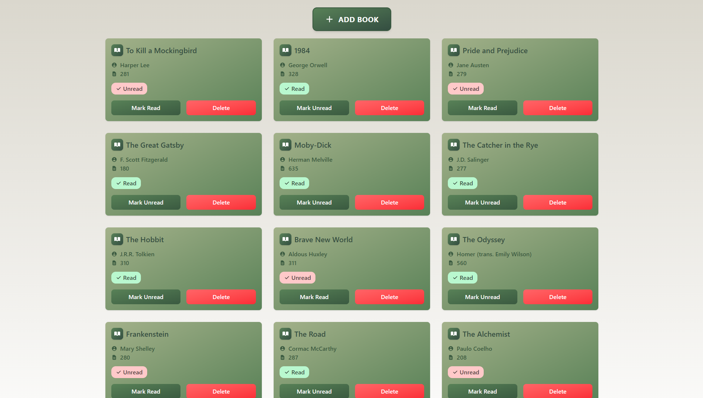

# 📚 Bookcase

A beautiful and intuitive personal library management web application built with vanilla JavaScript and styled with Tailwind CSS. Keep track of your reading collection with an elegant, responsive interface.



## ✨ Features

- **📖 Book Management**: Add, view, and delete books from your personal library
- **📊 Reading Status**: Track whether you've read each book with visual indicators
- **💾 Local Storage**: Your library persists between sessions using browser local storage
- **🎨 Beautiful UI**: Modern, responsive design with smooth animations and gradients
- **📱 Mobile Friendly**: Responsive grid layout that works on all device sizes
- **🔄 Interactive Elements**: Hover effects, smooth transitions, and intuitive controls

## 🎯 How to Use

### Adding a Book
1. Click the **"ADD BOOK"** button at the top of the page
2. Fill in the book details:
   - **Title**: The book's title
   - **Author**: The book's author
   - **Pages**: Number of pages
   - **Read Status**: Check if you've already read the book
3. Click **"Add Book"** to save it to your library

### Managing Your Library
- **Mark as Read/Unread**: Click the status button on any book card
- **Delete Books**: Click the "Delete" button to remove a book from your library
- **View Details**: Each book card displays title, author, page count, and read status

## 🛠️ Technology Stack

- **Frontend**: HTML5, Vanilla JavaScript (ES6+)
- **Styling**: Tailwind CSS v4.1.11
- **Storage**: Browser Local Storage
- **Build Tools**: Tailwind CLI

## 📁 Project Structure

```
Bookcase/
├── src/
│   ├── index.html      # Main HTML file
│   ├── app.js          # Core JavaScript functionality
│   ├── input.css       # Tailwind CSS input file
│   └── output.css      # Compiled CSS output
├── package.json        # Project dependencies
└── README.md          # This file
```

## 🎨 Design Features

- **Color Scheme**: Earthy green palette with cream accents ([Color Palette](https://coolors.co/palette/dad7cd-a3b18a-588157-3a5a40-344e41))
- **Typography**: Clean, readable fonts with proper hierarchy
- **Animations**: Smooth fade-in/fade-out effects for modals
- **Responsive Grid**: Auto-filling grid that adapts to screen size
- **Interactive Elements**: Hover effects and micro-interactions

## 🔧 Development

### Custom Styling
The project uses a custom Tailwind CSS theme with predefined colors:
- `cream`: #dad7cd (background)
- `gren1`: #a3b18a (primary text)
- `gren2`: #588157 (secondary elements)
- `gren3`: #3a5a40 (accents)
- `gren4`: #344e41 (dark accents)

### Key Functions
- `addBookToLibrary()`: Creates and stores new books
- `renderLibrary()`: Updates the DOM with current library state
- `toggleReadStatus()`: Switches read/unread status
- `deleteBook()`: Removes books from the library
- Local storage integration for data persistence

## 📚 About The Project

This project was built as part of [The Odin Project](https://www.theodinproject.com/) curriculum to solidify JavaScript knowledge. It goes beyond the basic requirements by implementing:

- Professional, modern UI design
- Local storage for data persistence
- Responsive layout with smooth animations
- Accessibility considerations
- Clean, maintainable code structure

### Assignment Goals Achieved ✅

- ✅ Book constructor with unique IDs using `crypto.randomUUID()`
- ✅ Array-based data storage with separation of concerns
- ✅ Dynamic book display with card-based layout
- ✅ Modal form for adding new books using `<dialog>` element
- ✅ Delete functionality with data-attribute association
- ✅ Read status toggle functionality
- ✅ **Bonus**: Local storage implementation for data persistence

## 🙏 Acknowledgments

- Built as part of [The Odin Project](https://www.theodinproject.com/) curriculum
- Icons provided by Heroicons
- Styled with [Tailwind CSS](https://tailwindcss.com/)
- Color palette from [Coolors.co](https://coolors.co/palette/dad7cd-a3b18a-588157-3a5a40-344e41)